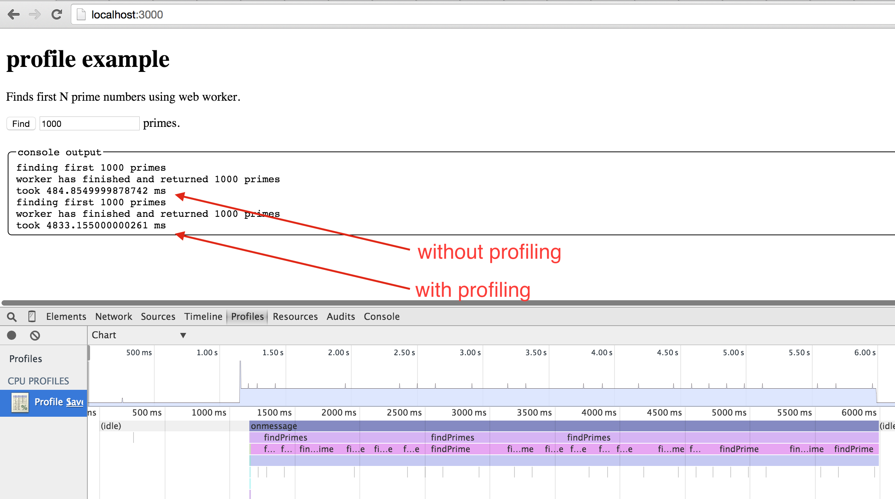

# profile-example

> Test example for profiling web worker

Finds N first prime numbers in a web worker. Requires any static web server to load, for
example [http-server](https://www.npmjs.com/package/http-server)

    sudo npm install -g http-server
    git clone https://github.com/bahmutov/profile-example.git
    cd profile-example
    http-server -p 3000

Then open browser `http://localhost:3000`

In Chrome Version 42.0.2311.90 (64-bit) Mac OS X there is a quirk - when running the
profiler on the web worker or main thread, the code slows down by 10x. I did not see (or at least I do not
remember if I ever saw this in Chrome Canary 44.0.2378.0 canary (64-bit))

* Click "Find" button
    - Finding 1000 primes should take about 400ms
* Open DevTools and start the CPU profile
    - You can profile main thread or the web worker thread
* Click "Find" button again
    - The same result is computed in 4.5 seconds

### Small print

Author: Gleb Bahmutov &copy; 2015

* [@bahmutov](https://twitter.com/bahmutov)
* [glebbahmutov.com](http://glebbahmutov.com)
* [blog](http://glebbahmutov.com/blog/)

License: MIT - do anything with the code, but don't blame me if it does not work.

Spread the word: tweet, star on github, etc.

Support: if you find any problems with this module, email / tweet /
[open issue](https://github.com/bahmutov/profile-example/issues) on Github
